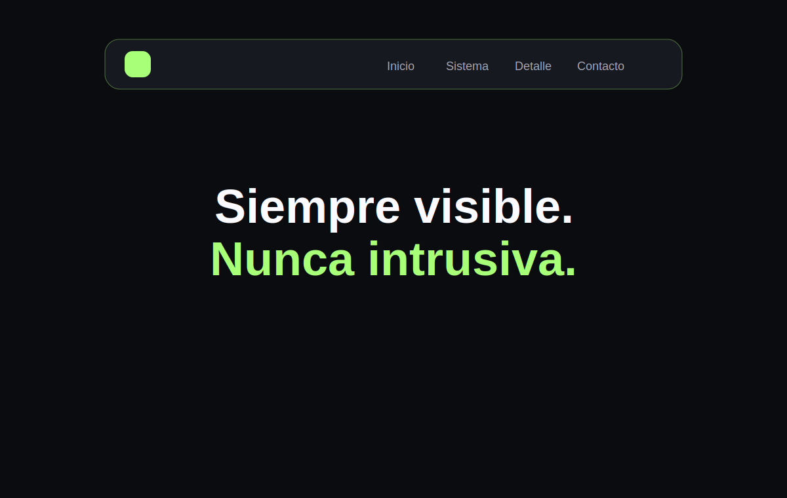

# Floating Navbar Effect

Barra flotante que cambia de forma mientras transforma tres escenas dentro de un solo bloque.

## Características

- Cambio de escena mediante clic, rueda o teclado.
- Indicador activo con movimiento spring.
- Menú móvil con Escape, clic exterior y retorno de foco.
- Navegación completa por teclado.

## Demo en vivo

[navbar.ntdesweb.dev](https://navbar.ntdesweb.dev/)

## Instalación

Clona el repositorio, entra en `floating-navbar-effect` y abre `index.html`.

## Estructura del proyecto

Navegación y secciones en `index.html`, responsive en `style.css`, estados en `script.js` y SVG en `assets/`.

## Cómo personalizarlo

Añade escenas al arreglo `content`, su botón `data-scene` y el artículo visual correspondiente.

## Accesibilidad

Usa `nav`, `aria-current`, `aria-expanded`, cierre con Escape, objetivos táctiles y foco visible.

## Rendimiento

El cambio de escena anima solo `transform` y `opacity`, con bloqueo breve de la rueda para evitar saltos.

## Licencia y créditos

[MIT](LICENSE). Creado por [Nacho Torres](https://github.com/NachoTorresRD) para [NTDESWEB](https://www.ntdesweb.com) con [NT-SKILL SUPREME](https://github.com/NachoTorresRD/nt-skill-supreme).

[Ver en GitHub](https://github.com/NachoTorresRD/floating-navbar-effect) · [Trabajar con NTDESWEB](https://www.ntdesweb.com)
